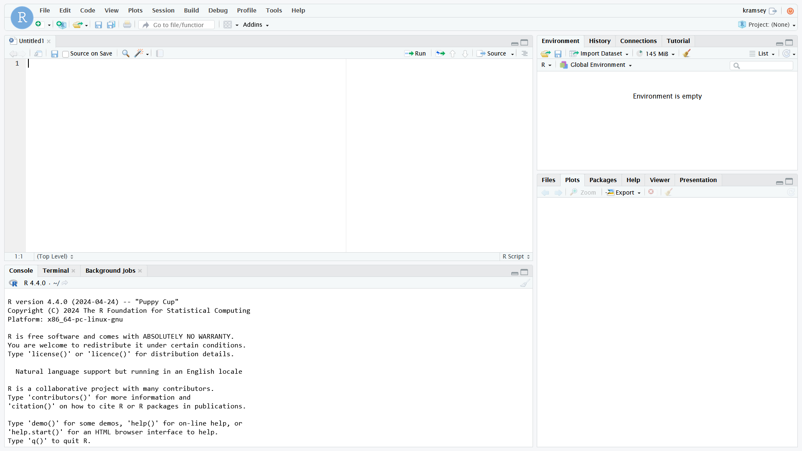

# Batch Connect - OSC RStudio Server


[](https://opensource.org/licenses/MIT)

## Overview

An [Open OnDemand](https://openondemand.org/) Batch Connect app that launches an [RStudio](https://posit.co/products/open-source/rstudio) server as an interactive session on OSC HPC clusters. RStudio is an open-source development environment for R.

This app uses the Batch Connect `basic` template with Slurm and supports
clusters: Ascend, Pitzer, Cardinal, and Kubernetes.

- **Upstream project:** [RStudio](https://posit.co/products/open-source/rstudio)

## Screenshots



## Features

- Launches RStudio Server in a web browser
- Runs on OSC compute nodes through interactive jobs
- Configurable cores, memory, wall time, and R version via the launch form
- Access to OSC file systems (home, project, scratch) from within the session
- Built-in RStudio tools: console, script editor, plots pane, terminal

## Requirements

### Compute Node Software

- [Lmod] 6.0.1+ or any other `module restore` and `module load <modules>` based CLI used to load appropriate environments within the batch job before launching the RStudio Server.

**without Singularity**

- [R] 3.3.2+ (earlier versions are untested but may work for you)
- [RStudio Server] 1.0.136+ (earlier versions are untested by may work for you)
- [PRoot] 5.1.0+ (used to setup fake bind mount)

**or with Singularity**

- [Singularity] 2.4.2+
- A Singularity image similar to [nickjer/singularity-rstudio]
- Corresponding module to launch the above Singularity image (see
  [example_module])

### Open OnDemand

- Open OnDemand
- Scheduler: Slurm, Kubernetes

[R]: https://www.r-project.org/
[RStudio Server]: https://www.rstudio.com/products/rstudio-server/
[PRoot]: https://proot-me.github.io/
[Singularity]: http://singularity.lbl.gov/
[Lmod]: https://www.tacc.utexas.edu/research-development/tacc-projects/lmod
[nickjer/singularity-rstudio]: https://www.singularity-hub.org/collections/463
[example_module]: https://github.com/nickjer/singularity-rstudio/blob/master/example_module/

## App Installation

### 1. Clone the repository

Use git to clone this app and checkout the desired branch/version you want to
use:

```sh
scl enable git19 -- git clone https://github.com/OSC/bc_osc_rstudio_server.git
cd bc_osc_rstudio_server
# Pin to a release (recommended)
scl enable git19 -- git checkout v0.33.0
```

To update the app you would:

```sh
cd bc_osc_rstuio_server
scl enable git19 -- git fetch
scl enable git19 -- git checkout <tag/branch>
```

### 2. Configure for your site
Edit `form.yml` and update these values for your cluster:                                                                                               | Attribute          | OSC Default                          | Change to                        |
|--------------------|--------------------------------------|----------------------------------|
| `cluster`          | `ascend`, `pitzer`, `cardinal`, etc. | Your cluster name(s)             |
| `version`  | `4.4.0` (and others)                 | R versions available on your system |
| `node_type`        | OSC-specific node types              | Node types available on your cluster |
| `num_cores`    | `28`                                 | Max cores on your compute nodes  |

### 3. Verify 
No OOD restart is needed (Batch Connect apps are detected automatically). Visit your OOD dashboard and look for **RStudio Server** under **Interactive Apps > Servers**.

## Configuration
### form.yml attributes
| Attribute | Description | Default |
|-----------|-------------|---------|
| `cluster` | Target cluster ID(s) | `ascend`, `pitzer`, `kubernetes`, `kubernetes-test`, `kubernetes-dev`, `cardinal` |
| `num_cores` | Number of cores | `1` | 
| `bc_num_hours` | Maximum wall time (hours) | `1` | 

<!--### Environment variables-->

## Troubleshooting

### Job starts but app doesn't appear (Batch Connect)

1. Check the job's `output.log` in `~/ondemand/data/sys/YOUR-APP/`
2. Verify the module loads correctly: `module load software/1.0`

<!-- Add more here in the future as it comes up -->

## Testing
| Site                      | OOD Version    | Scheduler | Status     |
|---------------------------|----------------|-----------|------------|
| Ohio Supercomputer Center | 4.1.4 | Slurm/K8s     | Production |

To verify your installation:

1. Launch the app from the OOD dashboard with default settings
2. Confirm the application loads in the browser

## Known Limitations
- GPU nodes can be selected via node type in the launch form, but no GPU-specific environment is configured automatically (e.g., CUDA modules); additional setup is required for GPU-enabled workflows
- Only tested on RHEL

## Contributing

Contributions are welcome. To contribute:

1. Fork it ( https://github.com/OSC/bc_osc_rstudio_server/fork )
2. Create your feature branch (`git checkout -b my-new-feature`)
3. Submit a pull request with a description of your changes

For bugs or feature requests, [open an issue](https://github.com/OSC/bc_osc_rstudio_server/issues).

This app is part of the [OOD Appverse](https://ondemand.connectci.org/affinity-groups/ood-appverse). Join the [Appverse Affinity Group](https://ondemand.connectci.org/affinity-groups/ood-appverse) to connect with other contributors.

## References
- [RStudio](https://posit.co/products/open-source/rstudio) - The application launched by this OOD app
- [Open OnDemand](https://openondemand.org/) — the HPC portal framework

## License

* Documentation, website content, and logo is licensed under
  [CC-BY-4.0](https://creativecommons.org/licenses/by/4.0/)
* Code is licensed under MIT (see LICENSE.txt)o
* RStudio, Shiny and the RStudio logo are all registered trademarks of RStudio.

## Acknowledgments

This app is built on [Open OnDemand](https://openondemand.org/), developed and
maintained by the [Ohio Supercomputer Center (OSC)](https://www.osc.edu/).

Open OnDemand is supported by the National Science Foundation under awards
[NSF SI2-SSE-1534949](https://www.nsf.gov/awardsearch/showAward?AWD_ID=1534949)
and [NSF CSSI-Frameworks-1835725](https://www.nsf.gov/awardsearch/showAward?AWD_ID=1835725).

## RServer command line arguements

This was the output of `--help` from version `2021.09.1`.

```
command-line options:

verify:
  --verify-installation arg (=0)        Runs verification mode to verify the 
                                        current installation.

server:
  --server-working-dir arg (=/)         The default working directory of the 
                                        rserver process.
  --server-user arg (=rstudio-server)   The user account of the rserver 
                                        process.
  --server-daemonize arg (=0)           Indicates whether or not the rserver 
                                        process should run as a daemon.
  --server-pid-file arg (=/var/run/rstudio-server.pid)
                                        The path to a file where the rserver 
                                        daemon's pid is written.
  --server-app-armor-enabled arg (=0)   Indicates whether or not to enable 
                                        AppArmor profiles for the rserver 
                                        process.
  --server-set-umask arg (=1)           If enabled, sets the rserver process 
                                        umask to 022 on startup, which causes 
                                        new files to have rw-r-r permissions.
  --secure-cookie-key-file arg          If set, overrides the default path of 
                                        the secure-cookie-key file used for 
                                        encrypting cookies.
  --server-data-dir arg (=/var/run/rstudio-server)
                                        Path to the data directory where 
                                        RStudio Server will write run-time 
                                        state.
  --server-add-header arg               Adds a header to all responses from 
                                        RStudio Server. This option can be 
                                        specified multiple times to add 
                                        multiple headers.

www:
  --www-address arg (=0.0.0.0)          The network address that RStudio Server
                                        will listen on for incoming 
                                        connections.
  --www-port arg                        The port that RStudio Server will bind 
                                        to while listening for incoming 
                                        connections. If left empty, the port 
                                        will be automatically determined based 
                                        on your SSL settings (443 for SSL, 80 
                                        for no SSL).
  --www-root-path arg (=/)              The path prefix added by a proxy to the
                                        incoming RStudio URL. This setting is 
                                        used so RStudio Server knows what path 
                                        it is being served from. If running 
                                        RStudio Server behind a path-modifying 
                                        proxy, this should be changed to match 
                                        the base RStudio Server URL.
  --www-local-path arg (=www)           The relative path from the RStudio 
                                        installation directory, or absolute 
                                        path where web assets are stored.
  --www-symbol-maps-path arg (=www-symbolmaps)
                                        The relative path from the RStudio 
                                        installation directory, or absolute 
                                        path, where symbol maps are stored.
  --www-use-emulated-stack arg (=0)     Indicates whether or not to use GWT's 
                                        emulated stack.
  --www-thread-pool-size arg (=2)       The size of the threadpool from which 
                                        requests will be serviced. This may be 
                                        increased to enable more concurrency, 
                                        but should only be done if the 
                                        underlying hardware has more than 2 
                                        cores. It is recommended to use a value
                                        that is <= to the number of hardware 
                                        cores, or <= to two times the number of
                                        hardware cores if the hardware utilizes
                                        hyperthreading.
  --www-proxy-localhost arg (=1)        Indicates whether or not to proxy 
                                        requests to localhost ports over the 
                                        main server port. This should generally
                                        be enabled, and is used to proxy HTTP 
                                        traffic within a session that belongs 
                                        to code running within the session 
                                        (e.g. Shiny or Plumber APIs)
  --www-verify-user-agent arg (=1)      Indicates whether or not to verify 
                                        connecting browser user agents to 
                                        ensure they are compatible with RStudio
                                        Server.
  --www-same-site arg                   The value of the 'SameSite' attribute 
                                        on the cookies issued by RStudio 
                                        Server. Accepted values are 'none' or 
                                        'lax'. The value 'none' should be used 
                                        only when RStudio is hosted into an 
                                        iFrame. For compatibility with some 
                                        browsers (i.e. Safari 12), duplicate 
                                        cookies will be issued by RStudio 
                                        Server when 'none' is used.
  --www-frame-origin arg (=none)        Specifies the allowed origin for the 
                                        iFrame hosting RStudio if iFrame 
                                        embedding is enabled.
  --www-enable-origin-check arg (=0)    If enabled, cause RStudio to enforce 
                                        that incoming request origins are from 
                                        the host domain. This can be added for 
                                        additional security. See 
                                        https://cheatsheetseries.owasp.org/chea
                                        tsheets/Cross-Site_Request_Forgery_Prev
                                        ention_Cheat_Sheet.html#verifying-origi
                                        n-with-standard-headers
  --www-allow-origin arg                Specifies an additional origin that 
                                        requests are allowed from, even if it 
                                        does not match the host domain. Used if
                                        origin checking is enabled. May be 
                                        specified multiple times for multiple 
                                        origins.

rsession:
  --rsession-which-r arg                The path to the main R program (e.g. 
                                        /usr/bin/R). This should be set if no 
                                        versions are specified in 
                                        /etc/rstudio/r-versions and the default
                                        R installation is not available on the 
                                        system path.
  --rsession-path arg (=rsession)       The relative path from the RStudio 
                                        installation directory, or absolute 
                                        path to the rsession executable.
  --rldpath-path arg (=r-ldpath)        The path to the r-ldpath script which 
                                        specifies extra library paths for R 
                                        versions.
  --rsession-ld-library-path arg        Specifies additional LD_LIBRARY_PATHs 
                                        to use for R sessions.
  --rsession-config-file arg            If set, overrides the path to the 
                                        /etc/rstudio/rsession.conf 
                                        configuration file. The specified path 
                                        may be a relative path from the RStudio
                                        installation directory, or an absolute 
                                        path.
  --rsession-proxy-max-wait-secs arg (=10)
                                        The maximum time to wait in seconds for
                                        a successful response when proxying 
                                        requests to rsession.
  --rsession-memory-limit-mb arg (=0)   The limit in MB that an rsession 
                                        process may consume.
  --rsession-stack-limit-mb arg (=0)    The limit in MB that an rsession 
                                        process may consume for its stack.
  --rsession-process-limit arg (=0)     The maximum number of allowable 
                                        rsession processes.

database:
  --database-config-file arg            If set, overrides the path to the 
                                        /etc/rstudio/database.conf 
                                        configuration file.
  --db-command arg                      Executes the shell command specified 
                                        injecting the current database 
                                        configuration in the command.

auth:
  --auth-none arg (=1)                  If set, disables multi-user 
                                        authentication. Workbench/Pro features 
                                        may not work in this mode.
  --auth-validate-users arg (=0)        Indicates whether or not to validate 
                                        that authenticated users exist on the 
                                        target system. Disabling this option 
                                        may cause issues to start or to run a 
                                        session.
  --auth-stay-signed-in-days arg (=30)  The number of days to keep a user 
                                        signed in when using the "Stay Signed 
                                        In" option. Will only take affect when 
                                        auth-timeout-minutes is 0 (disabled).
  --auth-timeout-minutes arg (=60)      The number of minutes a user will stay 
                                        logged in while idle before required to
                                        sign in again. Set this to 0 (disabled)
                                        to enable legacy timeout 
                                        auth-stay-signed-in-days.
  --auth-encrypt-password arg (=1)      Indicates whether or not to encrypt the
                                        password sent from the login form. For 
                                        security purposes, we strongly 
                                        recommend you leave this enabled.
  --auth-login-page-html arg (=/etc/rstudio/login.html)
                                        The path to a file containing 
                                        additional HTML customization for the 
                                        login page.
  --auth-rdp-login-page-html arg (=/etc/rstudio/rdplogin.html)
                                        The path to a file containing 
                                        additional HTML customization for the 
                                        login page, as seen by RDP users.
  --auth-required-user-group arg        Specifies a group that users must be in
                                        to be able to use RStudio.
  --auth-minimum-user-id arg (=auto)    Specifies a minimum user id value. 
                                        Users with a uid lower than this value 
                                        may not use RStudio.
  --auth-pam-helper-path arg (=rserver-pam)
                                        The relative path from the RStudio 
                                        installation directory, or absolute 
                                        path where the PAM helper binary 
                                        resides.
  --auth-pam-require-password-prompt arg (=1)
                                        Indicates whether or not to require the
                                        "Password: " prompt before sending the 
                                        password via PAM. In most cases, this 
                                        should be enabled. If using a custom 
                                        PAM password prompt, you may need to 
                                        disable this setting if PAM logins do 
                                        not work correctly.
  --auth-pam-requires-priv arg (=1)     Deprecated - will always be true.
  --auth-sign-in-throttle-seconds arg (=5)
                                        The minimum amount of time a user must 
                                        wait before attempting to sign in again
                                        after signing out.
  --auth-revocation-list-dir arg        If set, overrides the path to the 
                                        directory which contains the revocation
                                        list to be used for storing expired 
                                        tokens. As of RStudio Server 1.4, this 
                                        has been moved to database storage, and
                                        so this setting is deprecated, but will
                                        be used to port over any existing 
                                        file-based expired tokens.
  --auth-cookies-force-secure arg (=0)  Indicates whether or not auth cookies 
                                        should be forcefully marked as secure. 
                                        This should be enabled if running an 
                                        SSL terminator infront of RStudio 
                                        Server. Otherwise, cookies will be 
                                        marked secure if SSL is configured.

monitor:
  --monitor-interval-seconds arg (=60)  The interval in seconds at which the 
                                        monitor is probed for new data.

general:
  --help                                print help message
  --test-config                         test to ensure the config file is valid
  --config-file arg                     configuration file
